# Informe Obligatorio — Milestone 1
### TP Agentes · Maestría en Inteligencia Artificial (UdeSA)

---

## 1. Visión general del sistema

El sistema implementa un agente conversacional con capacidad de uso de herramientas siguiendo el patrón **ReAct** (Reason + Act). El agente recibe un mensaje del usuario, consulta a un LLM, ejecuta herramientas si el LLM las solicita, y devuelve una respuesta final en texto plano.

El framework está dividido en dos capas:

| Capa | Módulo | Responsabilidad |
|---|---|---|
| **Librería de la cátedra** | `mia_agents/` | Comunicación con proveedores LLM (Ollama/Bedrock), tipos de datos, generación de schemas |
| **Implementación del alumno** | `student_framework/` | Bucle del agente, registro de herramientas, lógica ReAct |

---

## 2. Diagrama de arquitectura

La siguiente sección contiene el prompt para generar el diagrama de cajas y flechas del sistema. Pegar el código en [https://mermaid.live](https://mermaid.live) o en cualquier editor que soporte Mermaid (VS Code, GitHub, Notion) para obtener el diagrama visual.

[INICIO IMAGEN]

```mermaid
flowchart TB
    %% ── Estilos ──────────────────────────────────────────
    classDef external  fill:#f0f0f0,stroke:#999,color:#333
    classDef framework fill:#dbeafe,stroke:#3b82f6,color:#1e3a5f
    classDef agent     fill:#dcfce7,stroke:#16a34a,color:#14532d
    classDef tool      fill:#fef9c3,stroke:#ca8a04,color:#713f12
    classDef mia       fill:#ede9fe,stroke:#7c3aed,color:#3b0764
    classDef provider  fill:#fce7f3,stroke:#db2777,color:#831843

    %% ── Entorno externo ──────────────────────────────────
    subgraph ENTORNO["⬛ Entorno de ejecución"]
        direction LR
        CLI["CLI\npython -m mia_agents.cli run\n--message '...'"]:::external
        TESTS["Tests de conformidad\ntest_m1.py\nMockLLMClient"]:::external
    end

    %% ── student_framework ────────────────────────────────
    subgraph SFW["🟦 student_framework"]
        direction TB

        BA["build_agent(config)\n__init__.py\n─────────────────\nCrea MyAgent\nRegistra 3 herramientas\nDevuelve Agent"]:::framework

        subgraph MYAGENT["🟩 MyAgent  (agent.py)"]
            direction TB
            INIT["__init__()\n─────────────────────\n_llm: LLMClient\n_tools: dict[str, Callable]\n_schemas: dict[str, ToolSchema]\n_max_iterations: int\n_max_history_messages: int"]:::agent
            REG["register_tool(tool, schema)\n─────────────────────\n_tools[schema.name] = tool\n_schemas[schema.name] = schema"]:::agent
            RUN["run(user_message) → AgentResult\n─────────────────────\nmessages = [{role:user, content:msg}]\nfor _ in range(max_iterations):\n  response = llm.chat(messages, tools=schemas)\n  if not response.tool_calls → return\n  ejecutar herramientas → agregar role:tool\nreturn AgentResult"]:::agent
            DISP["Dispatcher interno\n─────────────────────\nkwargs = json.loads(tc.arguments)\nresult = _tools[tc.name](**kwargs)\nAgentStep registrado"]:::agent
        end

        subgraph TOOLSET["🟨 Herramientas  (tools/)"]
            direction LR
            CALC["calculator\n─────────────\n+  −  ×  ÷\nsin eval"]:::tool
            READER["read_text_file\n─────────────\nUTF-8 ≤ 100 KB\nPathlib"]:::tool
            THERMO["thermo_converter\n─────────────\nP V T E m n R\n7 categorías"]:::tool
        end
    end

    %% ── mia_agents ───────────────────────────────────────
    subgraph MIA["🟣 mia_agents  (librería de la cátedra)"]
        direction TB

        TS["ToolSchema\n─────────────────────\nname: str\ndescription: str\nparameters: dict (JSON Schema)\n─────────────────────\nfrom_callable(fn) → lee Annotated + docstring\nto_llm_spec() → {name, description, parameters}"]:::mia

        LC["LLMClient.chat(messages, tools, system)\n─────────────────────\n1. _tool_specs_as_dicts(): ToolSchema → dict\n2. _format_tools(): dict → formato del proveedor\n3. Delega al proveedor activo"]:::mia

        subgraph PROVS["Proveedores"]
            direction LR
            OP["OllamaProvider\n──────────────\n_wrap_tool_spec():\n{type:function,\n function:{name,\n  description,\n  parameters}}\n──────────────\noptions: temperature\n         num_ctx=16384"]:::provider
            BP["BedrockProvider\n──────────────\n_wrap_tool_spec():\n{toolSpec:{name,\n description,\n inputSchema:\n  {json:{...}}}}\n──────────────\nboto3 Converse API\ntoolConfig"]:::provider
        end
    end

    %% ── Servicios LLM externos ───────────────────────────
    subgraph EXT["⬛ Servicios LLM externos"]
        direction LR
        OLLAMA["Ollama (local)\nllama3.1\nlocalhost:11434"]:::external
        BEDROCK["AWS Bedrock\namazon.nova-lite\nus-east-1"]:::external
    end

    %% ── Flujo de CONFIGURACIÓN (build_agent) ─────────────
    CLI  -->|"build_agent(config)"| BA
    TESTS -->|"build_agent({llm_client: mock})"| BA
    BA -->|"register_tool(calculator, schema)"| REG
    BA -->|"register_tool(read_text_file, schema)"| REG
    BA -->|"register_tool(thermo_converter, schema)"| REG

    %% ── Flujo de EJECUCIÓN (run) ─────────────────────────
    CLI  -->|"agent.run(mensaje)"| RUN
    TESTS -->|"agent.run(mensaje)"| RUN

    RUN -->|"chat(messages,\ntools=list(_schemas.values()))"| LC
    LC  -->|"ToolSchema.to_llm_spec()"| TS
    TS  -.->|"dict normalizado"| LC

    LC --> OP
    LC --> BP
    OP -->|"ollama.Client.chat(**kwargs)"| OLLAMA
    BP -->|"boto3.converse(**kwargs)"| BEDROCK
    OLLAMA -->|"ChatResponse\n(content / tool_calls)"| OP
    BEDROCK -->|"Converse response\n(output.message)"| BP
    OP -->|"LLMResponse"| LC
    BP -->|"LLMResponse"| LC
    LC -->|"LLMResponse\n(content, tool_calls,\ninput_tokens, output_tokens)"| RUN

    %% ── Despacho de herramientas ─────────────────────────
    RUN -->|"tc.name + tc.arguments (JSON)"| DISP
    DISP -->|"calculator(left, right, op)"| CALC
    DISP -->|"read_text_file(path)"| READER
    DISP -->|"thermo_converter(value, from, to)"| THERMO
    CALC   -->|"str"| DISP
    READER -->|"str"| DISP
    THERMO -->|"str"| DISP
    DISP -->|"message {role:tool, content:str}"| RUN

    %% ── Resultado final ──────────────────────────────────
    RUN -->|"AgentResult\n(answer, steps)"| CLI
    RUN -->|"AgentResult\n(answer, steps)"| TESTS
```



[FIN IMAGEN]

---

## 3. Diseño de la interfaz de herramientas

Esta sección describe con precisión cómo una herramienta Python viaja desde su definición hasta el LLM y de regreso.

### 3.1 `ToolSchema`: la unidad de descripción

`ToolSchema` (definido en `mia_agents/types.py`) es el objeto que describe una herramienta al LLM. Tiene tres campos:

```python
@dataclass
class ToolSchema:
    name: str               # Identificador único; el LLM lo usa en tool_call.name
    description: str        # Docstring limpio de la función; le dice al LLM qué hace
    parameters: dict        # JSON Schema de los parámetros de entrada
```

**Creación con `ToolSchema.from_callable(fn)`** (implementado en `mia_agents/tool_schema.py`):

1. Lee las anotaciones de tipo de la firma Python con `get_type_hints(fn, include_extras=True)`.
2. Para cada parámetro con `Annotated[tipo, Field(description="...")]`, extrae el tipo y la descripción.
3. Construye un modelo Pydantic temporal con `create_model()` y obtiene su JSON Schema con `model.model_json_schema()`.
4. Toma el docstring de la función con `inspect.getdoc(fn)` como descripción de la herramienta.

**Ejemplo real** — `calculator`:

```python
# Firma Python
def calculator(
    left_operand:  Annotated[float, Field(description="Primer operando.")],
    right_operand: Annotated[float, Field(description="Segundo operando.")],
    operator:      Annotated[str,   Field(description="Operador: +, -, * o /")],
) -> str: ...

# ToolSchema resultante
ToolSchema(
    name="calculator",
    description="Calcula el resultado de una operación aritmética entre dos números. ...",
    parameters={
        "type": "object",
        "title": "calculator_Input",
        "properties": {
            "left_operand":  {"type": "number", "description": "Primer operando."},
            "right_operand": {"type": "number", "description": "Segundo operando."},
            "operator":      {"type": "string", "description": "Operador: +, -, * o /"},
        },
        "required": ["left_operand", "right_operand", "operator"]
    }
)
```

---

### 3.2 `register_tool()`: qué almacena el agente

```python
# MyAgent.__init__ declara dos dicts internos:
self._tools:   dict[str, Callable[..., str]] = {}   # nombre → función Python
self._schemas: dict[str, ToolSchema]         = {}   # nombre → descripción para el LLM

# register_tool indexa ambos por el nombre del schema:
def register_tool(self, tool: Callable, schema: ToolSchema) -> None:
    self._tools[schema.name]   = tool    # ← callable ejecutable
    self._schemas[schema.name] = schema  # ← descripción para el LLM
```

La separación en dos dicts es intencional:

| Dict | Destinatario | Cuándo se usa |
|---|---|---|
| `_schemas` | LLM (vía `chat()`) | En **cada** llamada al LLM: se pasa como `tools=list(_schemas.values())` |
| `_tools` | Python (dispatcher) | Solo cuando el LLM emite un `tool_call` con ese nombre |

Después de `build_agent()`, ambos dicts tienen exactamente las mismas claves:
`"calculator"`, `"read_text_file"`, `"thermo_converter"`.

---

### 3.3 `chat(tools=...)`: qué viaja al `LLMClient`

En cada iteración del bucle ReAct, `run()` llama:

```python
response = self._llm.chat(
    messages=messages,                       # historial actual de la conversación
    tools=list(self._schemas.values()),      # lista de ToolSchema
    system=self._system,                     # system prompt
)
```

El argumento `tools` es una **lista de objetos `ToolSchema`**. No se pre-serializa ni se transforma en `run()`; esa responsabilidad es de `LLMClient`.

Si no hay herramientas registradas, `tools=None` (nunca `[]`, porque algunos proveedores rechazan una lista vacía).

---

### 3.4 `LLMClient`: qué hace con cada schema

`LLMClient` es un wrapper liviano que delega a un proveedor concreto. La transformación ocurre en tres pasos internos en `_BaseLLMProvider`:

#### Paso 1 — `_tool_specs_as_dicts()`: `ToolSchema → dict`

```python
# Para cada ToolSchema en la lista:
spec = schema.to_llm_spec()
# Resultado:
# {
#   "name": "calculator",
#   "description": "Calcula el resultado de...",
#   "parameters": { "type": "object", "properties": {...}, "required": [...] }
# }
```

#### Paso 2 — `_wrap_tool_spec()`: `dict → formato nativo del proveedor`

Cada proveedor tiene su propio formato de tool:

**OllamaProvider** (API de Ollama):
```python
{
    "type": "function",
    "function": {
        "name": "calculator",
        "description": "Calcula el resultado de...",
        "parameters": { "type": "object", "properties": {...}, "required": [...] }
    }
}
```

**BedrockProvider** (API Converse de AWS):
```python
{
    "toolSpec": {
        "name": "calculator",
        "description": "Calcula el resultado de...",
        "inputSchema": {
            "json": { "type": "object", "properties": {...}, "required": [...] }
        }
    }
}
```

#### Paso 3 — Llamada al proveedor y respuesta normalizada

El proveedor envía las herramientas formateadas a la API, recibe la respuesta y la normaliza a `LLMResponse`:

```python
@dataclass
class LLMResponse:
    content: str | None          # texto del LLM (None si solo hubo tool_calls)
    tool_calls: list[ToolCall]   # lista de invocaciones solicitadas
    input_tokens: int | None     # tokens de entrada (None en MockLLMClient)
    output_tokens: int | None    # tokens de salida (None en MockLLMClient)
    raw_response: dict | None    # payload crudo del proveedor (debug)
```

Cada `ToolCall` contiene:
```python
@dataclass
class ToolCall:
    id: str         # ID del call (sintetizado por Ollama; emitido por Bedrock)
    name: str       # nombre de la herramienta que el LLM quiere invocar
    arguments: str  # argumentos codificados en JSON {"left_operand": 15, ...}
```

---

### 3.5 Ciclo de vida completo de una herramienta

El siguiente diagrama de secuencia muestra el ciclo de vida de una invocación de `calculator` desde el registro hasta el resultado:

```
build_agent()
  └─ register_tool(calculator, calculator_schema)
        → _tools["calculator"]  = <función Python>
        → _schemas["calculator"] = ToolSchema(name="calculator", ...)

agent.run("¿Cuánto es 15 * 7?")
  │
  ├─[1] llm.chat(messages=[{role:user, content:"¿Cuánto es 15 * 7?"}],
  │              tools=[ToolSchema("calculator"), ToolSchema("read_text_file"), ToolSchema("thermo_converter")])
  │       │
  │       ├─ to_llm_spec() × 3   → dicts normalizados
  │       ├─ _wrap_tool_spec() × 3 → formato Ollama/Bedrock
  │       └─ API call → LLM recibe el schema de calculator y entiende qué puede hacer
  │
  ├─[2] LLMResponse(
  │       content=None,
  │       tool_calls=[ToolCall(id="call_a1b2", name="calculator",
  │                            arguments='{"left_operand":15,"right_operand":7,"operator":"*"}')]
  │     )
  │
  ├─[3] Dispatcher:
  │       kwargs = json.loads('{"left_operand":15,"right_operand":7,"operator":"*"}')
  │             = {"left_operand": 15.0, "right_operand": 7.0, "operator": "*"}
  │       result = _tools["calculator"](left_operand=15.0, right_operand=7.0, operator="*")
  │             = "105"
  │       AgentStep(tool_name="calculator", tool_input='...', tool_output="105")
  │
  ├─[4] messages.append({role:"tool", tool_call_id:"call_a1b2", content:"105"})
  │
  ├─[5] llm.chat(messages=[user, assistant(tool_call), tool(result)], tools=[...])
  │       └─ LLM recibe "105" y genera respuesta final en texto
  │
  └─[6] AgentResult(answer="El resultado de 15 × 7 es 105.", steps=[AgentStep(...)])
```

---

## 4. Limitaciones conocidas

### 4.1 Limitaciones del modelo local (Ollama / llama3.1)

- **Calidad del tool calling**: llama3.1 (8B) es un modelo relativamente pequeño. Puede alucinar nombres de herramientas, emitir JSON malformado en los argumentos, o responder con texto libre cuando debería invocar una herramienta. El agente maneja estos casos sin romperse, pero el resultado puede no ser correcto.
- **Velocidad de inferencia**: sin GPU, cada llamada al LLM puede tardar entre 5 y 30 segundos según el hardware. Conversaciones con múltiples tool calls se vuelven lentas.
- **Ventana de contexto**: la ventana configurada es de 16 384 tokens. Conversaciones largas con salidas de herramientas extensas (e.g., archivos de texto grandes) pueden acercarse al límite y degradar la calidad de la respuesta.
- **Idioma**: llama3.1 puede degradar su razonamiento cuando se le da un system prompt en español y mensajes en inglés (o viceversa). La calidad del tool calling puede variar según el idioma del prompt.

### 4.2 Limitaciones de la implementación actual (Milestone 1)

- **Sin statefulness entre llamadas a `run()`**: cada llamada a `run()` crea una lista `messages` local que se descarta al terminar. El LLM no recuerda turnos anteriores entre invocaciones distintas. Este comportamiento es correcto para M1; la statefulness se implementa en M2.
- **`structured_call()` sin implementar**: el método lanza `NotImplementedError`. La salida estructurada con herramienta sintética `final_result` y bucle de reparación Pydantic es responsabilidad de M2.
- **Sin conteo de tokens acumulado**: `AgentResult.input_tokens` y `AgentResult.output_tokens` siempre son `None` en M1. Los proveedores sí reportan tokens en `LLMResponse`, pero el agente no los acumula todavía.
- **Sin reintentos ante fallos transitorios**: si Ollama se reinicia o hay un timeout de red, el agente no reintenta la llamada automáticamente. La excepción se propaga al caller.
- **La CLI no conserva estado entre comandos**: `python -m mia_agents.cli run --message "..."` crea una nueva instancia del agente en cada ejecución. Aunque la statefulness de M2 funcione correctamente, no es observable desde la CLI sin modificarla.

### 4.3 Limitaciones del diseño de herramientas

- **Las herramientas solo pueden devolver `str`**: no hay soporte para tipos estructurados, binarios, streaming ni errores tipados. Si una herramienta necesita devolver múltiples valores (e.g., un dict con metadatos), debe serializar todo en un string.
- **Sin autorización por herramienta**: todas las herramientas registradas están disponibles para el LLM en todas las llamadas a `run()`. No existe un mecanismo para restringir qué herramientas se ofrecen según el contexto o el usuario.
- **El LLM decide qué herramienta usar**: si la descripción en el schema es ambigua, el LLM puede elegir la herramienta equivocada o no usar ninguna cuando debería. La calidad del tool calling depende directamente de la calidad de los docstrings y los `Field(description=...)`.
- **Herramientas síncronas y bloqueantes**: cada herramienta se ejecuta de forma secuencial y bloqueante. Si una herramienta tarda (e.g., leer un archivo en un disco lento), bloquea el bucle completo.

### 4.4 Limitaciones específicas por herramienta

| Herramienta | Limitación |
|---|---|
| `calculator` | Solo soporta operaciones binarias (+, -, ×, ÷). No maneja expresiones encadenadas ni potencias. El LLM debe descomponer expresiones complejas en llamadas sucesivas. |
| `read_text_file` | Solo archivos de texto plano UTF-8. No lee PDFs, DOCX, imágenes ni archivos binarios. Límite de 100 KB (≈ 25 000 palabras). Rutas relativas al CWD del proceso, no al del usuario. |
| `thermo_converter` | Solo convierte entre unidades de la **misma** categoría física. No resuelve la ley del gas ideal (PV = nRT) directamente; el LLM debe encadenar múltiples conversiones. La constante R se trata como una magnitud dimensional independiente y no como un vínculo entre categorías. |
